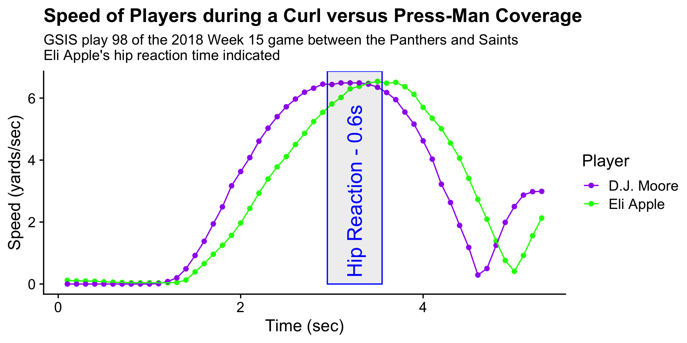
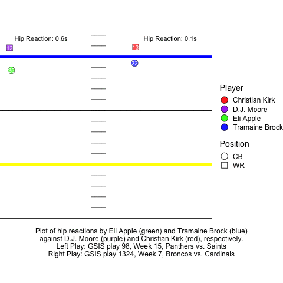
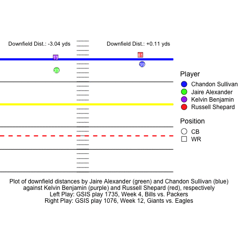
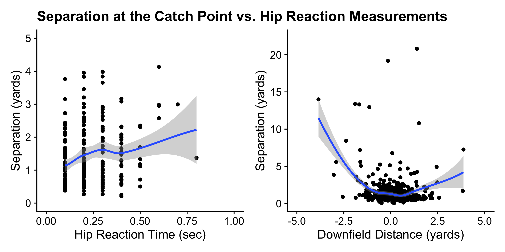
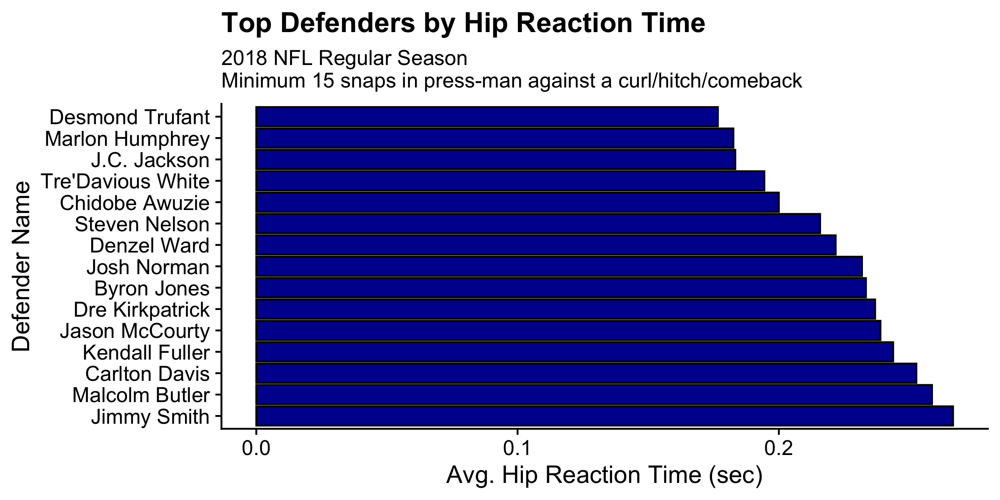
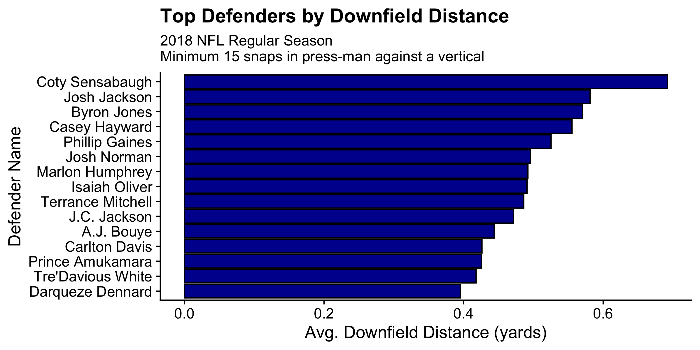

```{r setup, include=FALSE}
knitr::opts_chunk$set(echo = FALSE, message = FALSE)
```

```{r libraries}
library(knitr)
```

# Introduction

Two valuable traits of a cornerback are his hips and his ability to react to the receivers’ hips. At Duke Football, we play a lot of press-man coverage, so these traits become extremely important when playing in a receiver’s face and quickly adjusting to their routes. To train this, Coach Chris Hampton installed the Hip Reaction Drill.

In the Hip Reaction Drill, two players run next to each other: one acting as a wide receiver and the other as a cornerback. The wide receiver runs straight forward and at random times, drops his hips to slow down. There are two specific coaching points for the cornerback. The first is “when his hips drop, my hips drop.” This is to say that when the receiver starts to slow down, his hips will drop, and the cornerback should do the same in order to decelerate as soon as possible. The other coaching point is “stay on top.” This is to say that cornerbacks should be more upfield than the wide receiver, as we do not want our cornerbacks to get beat deep with no guaranteed safety help, as that’s how explosive plays happen. An example of this drill can be seen below.

```{r drill-trape, fig.align='center', fig.cap="An example of the Hip Reaction Drill, with #28 (green) acting as a cornerback and #31 (blue) acting as a wide receiver."}
include_graphics("figures/hip_reaction_drill.gif")
```

In this example, one can see #28 follow both coaching points. He quickly drops his hips when #31 drops his hips and stays on top. He does this by keeping his focus on #31’s hips and reacting with the necessary quick hip movement. This drill specifically trains cornerbacks for defending vertical-breaking routes (verticals, curls, hitches, and comebacks) when in press-man coverage. We hope that this drill will transfer over to gameday, in that #28 will stay on top of a receiver if the receiver were to run a vertical route and that #28 will quickly drop his hips and stay in sync with the receiver if the receiver were to drop his hips to decelerate and turn around to run a curl, hitch, or comeback.

This application to gameday is what I will examine in this study. I will look at times a defender plays press-man coverage and is defending a vertical-breaking route. In this, I will look at both the hip reaction time for defenders defending curls/hitches/comebacks and the downfield distance between the defender and the receiver when defending verticals. I will then assess a cornerback’s hips and his ability to react to the receivers’ hips.

# Data

In this study, I use two data sources. The first source is the data provided by the NFL Big Data Bowl 2021. This player-tracking data is given from Zebra’s RFID chips for every play in every 2018 NFL regular season game, and it provides coordinates and speeds for each player every 0.1 seconds.

The other source is ProFootballFocus. I will be using this play-by-play data for identifying coverages, press players, and routes. It should be noted that these categories could both be identified using tracking data alone (as I’m sure many other 2021 Big Data Bowl Competitors did!). However, because I’m looking at a niche situation, I did not want to leave room for modeling error when filtering, and so I decided to use PFF data.

After merging these two sources, creating a row for every press player and their respective receiver/route that they were covering, and filtering for just the four routes in question, we are left with 4,502 routes to examine, with 2,824 of those being verticals and 1,678 of those being comebacks, curls, and hitches.

# Methods

For every route, I examined the receiver’s movement and the defender’s movement after grouping them by the route the receiver runs. If the receiver runs a comeback, curl, or hitch, it means the receiver’s hip had to drop in order to stop and turn, so we will be focused on the coaching point, “when his hips drop, my hips drop,” by measuring hip reaction time. If the receiver runs a vertical, it means the receiver is just going deep and so we will be focused on the coaching point, “stay on top,” by measuring the downfield distance between the defender and the receiver. If the receiver is targeted by the quarterback, we will also measure the separation between the defender and the receiver when the ball arrives.

It should be noted that some plays become busted plays (due to fumbles, spikes, etc.), so if this busted play event occurs before our measurement, the play is omitted.

## Hip Reaction Time

To measure hip reaction time, we need to pinpoint when the receiver first drops his hips. Since the receiver is dropping his hips to decelerate, we can use the moment where the receiver first decelerates to indicate when the receiver’s hips start dropping. Similarly, we can see the moment the defender responds to this hip dropping by seeing when the defender first decelerates after the receiver decelerates.

However, there are a couple caveats. The first is that we do not use the acceleration column from the player-tracking data, as the acceleration column never has a negative number. To fix this, we look for the first point where a player’s speed is less than the player’s speed in the frame before it. Another caveat is that, especially in press coverage, there may be some hand-fighting at the line of scrimmage, so speed may go up and down at the start. To fix this, we don’t start tracking deceleration until the receiver is three yards past the line of scrimmage, as any hitch that is less than three yards down the field is more likely to be classified as a now route.

The process can be simplified by the plot below, where we see the first drops of speed in both the receiver and the cornerback mark the edges of the measured hip reaction time.

```{r hip-plot, fig.align='center'}

```

We can see below two examples of hip reactions against curls, with a poor example of hip reaction on the left and a good example on the right.

```{r hip-gif, fig.align='center'}

```

The left example is the play from the speed plot, in which we can see the harmful effects of a long hip reaction time. Eli Apple reacts slowly to D.J. Moore’s hip dropping, which creates a lot of separation at the top of the route, preventing Apple from making a play on the ball. In the right example, Tramaine Brock remains glued to Christian Kirk and is able to decelerate just after Kirk’s hips drop, allowing Brock to get a pass breakup. The fraction of a second difference in reactions makes all of the difference in the play.

## Downfield Distance

To measure downfield distance, we need to pinpoint when the defender identifies the route as a vertical. Once the defender realizes his man is running a vertical, his next goal is to close distance and get in phase with the receiver. Because closing distance is out of the scope of the Hip Reaction Drill, we just want to see if at this recognition point the defender “stays on top” of the receiver.

To detect this moment, I split the plays into two possible situations.  The first situation is that the quarterback can not throw any other route after that point (pass was thrown, sack, etc.). Any of these would indicate a point where we should look for whether the defender is on top of the receiver, as after this, the defender’s goal would change to playing the ball in whatever way applies to the situation. The other situation is that the receiver is more than 17 yards downfield. The 17-yard specification stems from my discussion with secondary coaches, who suggest that once the receiver passes 17 yards downfield, the defender will know that the receiver must be running a vertical, so he will then try to close the  distance. Therefore, we can measure downfield distance based on which of these two situations first arises.

In this study, downfield distance is defined as the distance that is parallel to the sideline between the receiver and the defender. This is not the same as separation, which is the hypotenuse between the two. I chose downfield distance, as the horizontal distance between the receiver and the defender is outside the scope of the drill.

We can see below two examples of downfield distance against verticals, with a poor example of staying on top on the left and a good example on the right.

```{r vert-gif, fig.align='center'}

```

In the left example, Jaire Alexander loses depth on Kelvin Benjamin less than 10 yards downfield, so when the ball is thrown, Benjamin is 16.42 yards downfield and Alexander has a downfield distance of -3.04, allowing Benjamin to gain 34 yards. In the right example, Chandon Sullivan stays on top of Russell Shepard with a downfield distance of +0.11 yards, forcing Eli Manning to throw a tough, contested back shoulder pass to the sideline 30 yards downfield.

# Results

Now that we’ve quantified hip reactions, we need to see if these statistics actually matter. To do so, let’s plot our two statistics versus separation at the catch point.

```{r separation-plots, fig.align='center'}

```

In these plots, we see what we would expect. In the plot on the left, separation seems to increase as hip reaction time increases, which makes sense, as the slow reaction should create this separation. In the plot on the right, we see large separation values when downfield distance is to an extreme on either side, which stems from the receiver creating separation early in the route. However, when downfield distance is closer to zero (or when the defender is closer to the receiver upon identifying a vertical route), separation appears to decrease as downfield distance increases, which provides evidence to why defenders should “stay on top.”

Now, we can rank defenders by both categories. We see the rankings for hip reaction time below.

```{r hip_ranks, fig.align='center'}

```

These rankings make sense physically, as the average reaction time is 0.15 seconds to touch stimulus and 0.18 - 0.2 seconds to visual stimulus (“Reaction Times to Sound, Light and Touch.”). These defenders are fully focused on the opponent’s hip and may even have a hand on their receiver, so we should expect these times.

We see the rankings for downfield distance below.

```{r dd-ranks, fig.align='center'}

```

This ranking should be taken with a grain of salt, as we know that a downfield distance too large can cause large separation, so Coty Sensabaugh may not be the best at “staying on top” despite having the highest downfield distance.

We see stars like Marlon Humphrey, J.C. Jackson, and Tre’Davious White in both rankings, which is a testament to their hips and ability to react to the receivers’ hips.

# Discussion

In this study, we quantified the results of the Hip Reaction drill. It should be noted that there are extensions to this study in terms of assessing cornerback play throughout all techniques, as we may find unique conclusions when assessing hip reactions in cornerbacks that play motor technique. It would also be interesting to explore how a cornerback’s hip reaction affects their ability to cover stutter-and-go or whip routes. With more access to film, these could certainly be studied.

It should also be noted that the data can at times be unreliable. While the data was mostly clean, there were plays such as GSIS play 2852 of the Week 17 game between the Jets and Patriots, where Robby Anderson only has two frames of data.

Still, this is a relevant study for NFL teams, as not only does this provide numbers to assess a defender’s traits and to justify a specific practice drill, it opens the door to trying to quantify other drills’ translation to the game.

# References

“Reaction Times to Sound, Light and Touch.” BioNumbers, Harvard University, bionumbers.hms.harvard.edu/bionumber.aspx. 

# Code

Code and data can be found here: https://github.com/charliegelman/BigDataBowl2021 
